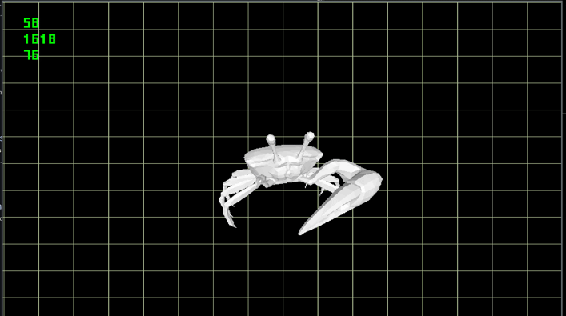

# A crab



## Build & Run

### PreBuild

you will need SDL2

`sudo pacman -S sdl12-compat`

### Build

```bash
make build
```

### Run

```bash
make run
```

## Basic control

### Camera
* Press and hold the Right Mouse Button to adjust the camera's yaw and pitch

## Dependencies
* SDL2